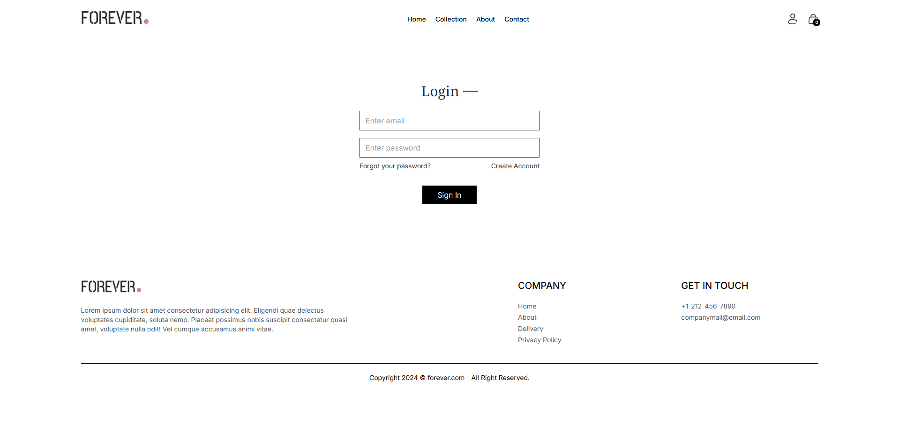
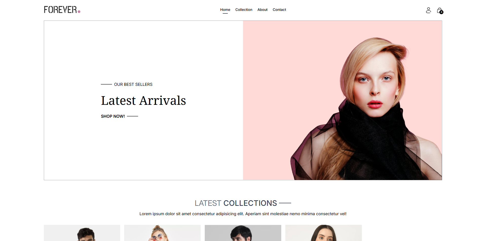
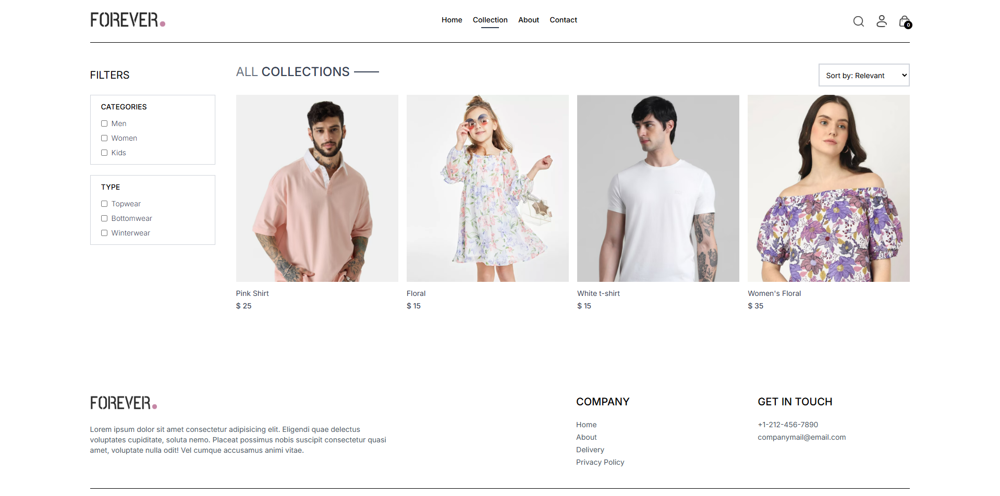
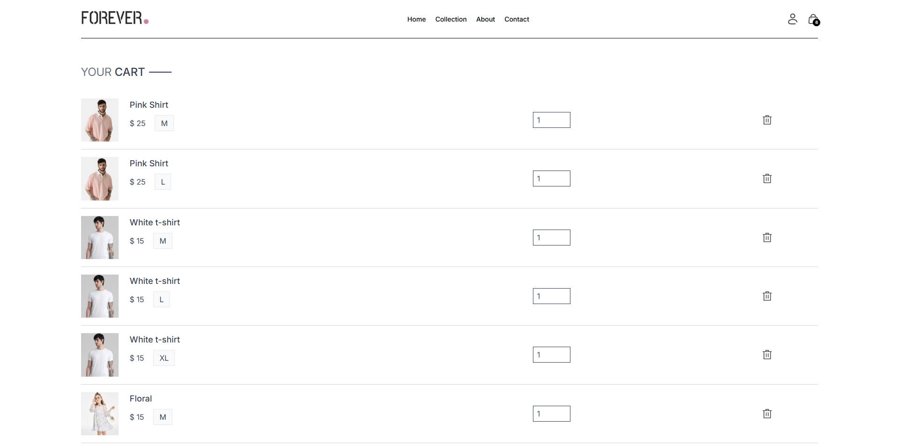
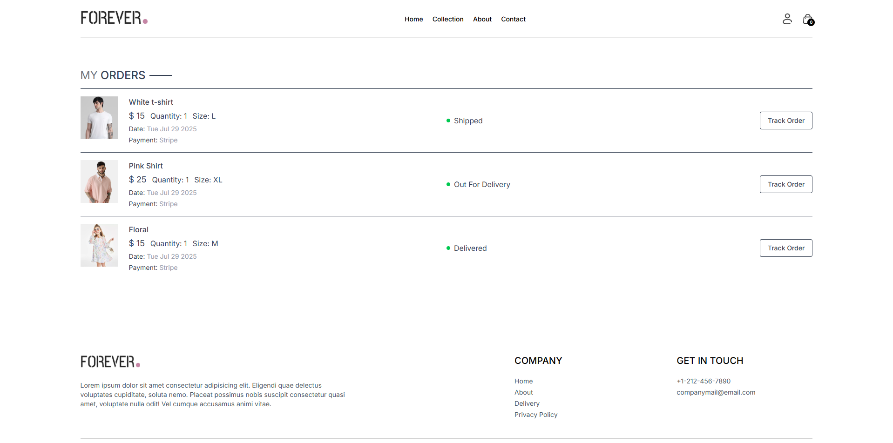
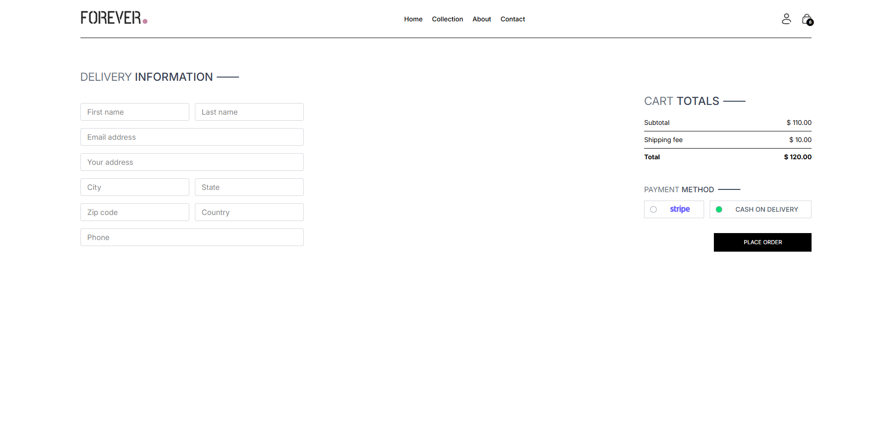
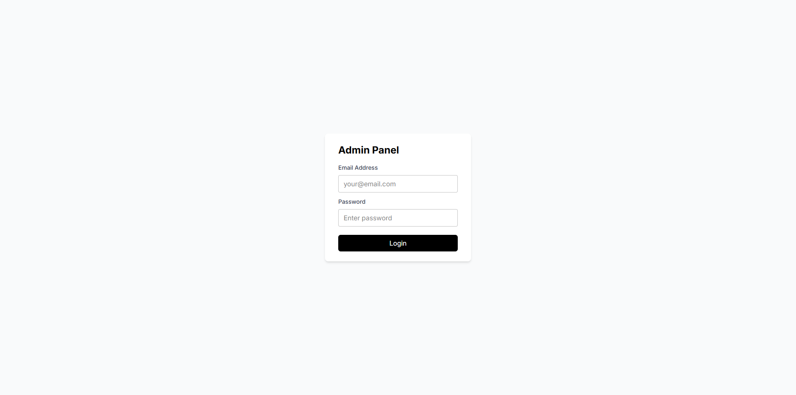
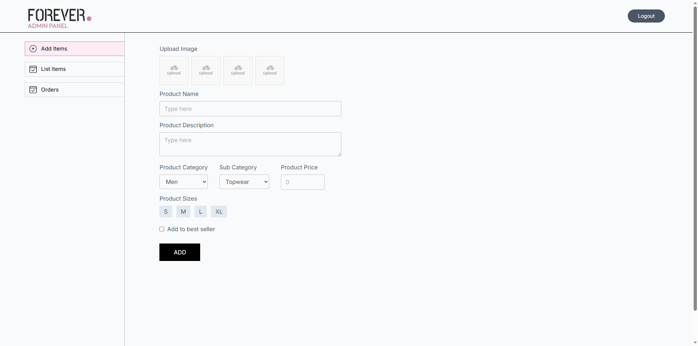
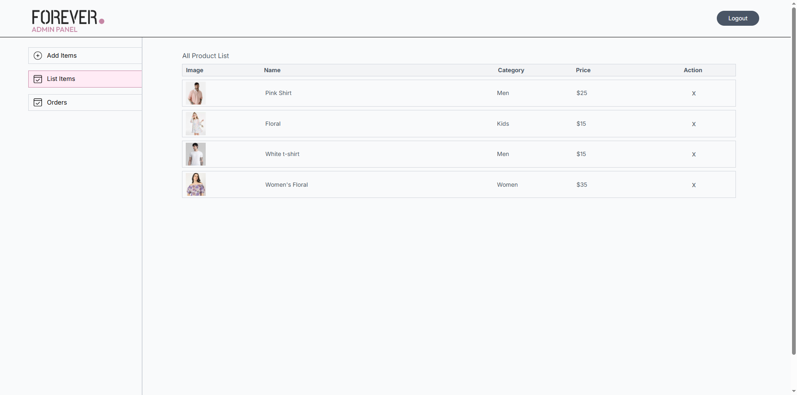
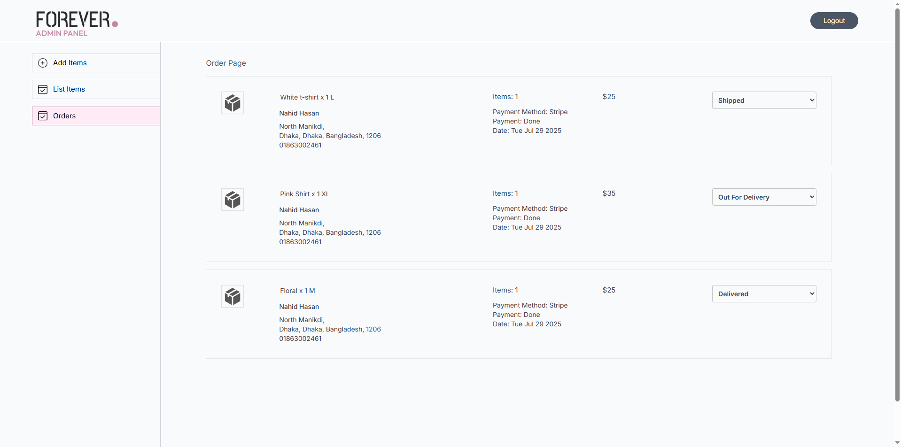

# Eccomerce Application - Full 'MERN' Stack

Tools:
- Backend: Express, MongoDb, Node.js
- Frontend: React.js (Javascript, HTML, Tailwind CSS)

## Screenshots

### Web:
#### User Panel:
 &ensp;&ensp;     
 &ensp;&ensp;     
 &ensp;&ensp;     

#### Admin Panel:

 &ensp;&ensp;     
 &ensp;&ensp;     
